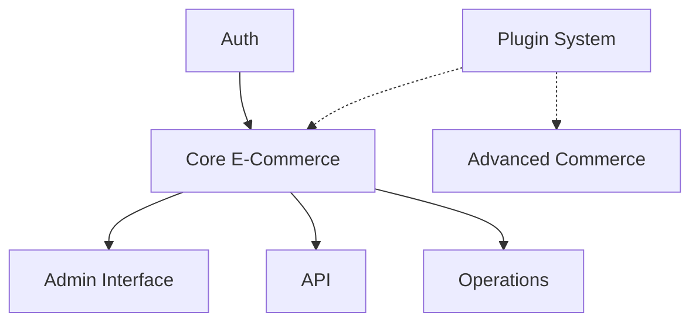

# Epic Overview

## V1 Epics (Current Focus)

### EPIC-001: Core E-Commerce Platform
**Goal**: Build a fully functional e-commerce platform without plugin architecture
**Status**: In Progress
**Priority**: P0 - Critical Path

**Key Features**:
- Product catalog with variants, collections, and categories
- Shopping cart and checkout flow
- Order management system
- Customer accounts with B2B support
- Admin dashboard

### EPIC-002: Authentication & Authorization
**Goal**: Integrate Better Auth with e-commerce specific requirements
**Status**: Foundation Complete
**Priority**: P0 - Critical Path

**Key Features**:
- Customer account management
- Admin user roles and permissions
- B2B account approval workflow
- Organization-based access control

### EPIC-003: Admin Interface
**Goal**: Build comprehensive admin dashboard for store management
**Status**: Planning
**Priority**: P1 - High

**Key Features**:
- Product management UI
- Order processing interface
- Customer management
- Analytics dashboard
- Settings and configuration

### EPIC-004: API & Integrations
**Goal**: Provide robust API layer for headless commerce
**Status**: Planning
**Priority**: P1 - High

**Key Features**:
- tRPC API for internal use
- REST API for external integrations
- Webhook system for events
- Stripe payment integration

### EPIC-005: Operational Features
**Goal**: Essential operational capabilities for running a store
**Status**: Planning
**Priority**: P2 - Medium

**Key Features**:
- Inventory management
- Shipping configuration
- Tax calculation
- Email notifications
- Reporting and analytics

## V2 Epics (Future Consideration)

### EPIC-006: Plugin System
**Goal**: Create extensible plugin architecture
**Status**: Deferred to V2
**Priority**: P3 - Future

**Key Features**:
- Plugin loader and registry
- Hook system for extensions
- Plugin marketplace
- Developer tools

### EPIC-007: Advanced Commerce
**Goal**: Enterprise and advanced features
**Status**: Future
**Priority**: P3 - Future

**Key Features**:
- Multi-store support
- Advanced B2B features
- Subscription commerce
- AI-powered recommendations

## Epic Dependencies

## Success Metrics

### V1 Success Criteria
- [ ] Complete product catalog with search
- [ ] Functional checkout with Stripe
- [ ] Order management workflow
- [ ] Customer portal
- [ ] Admin dashboard
- [ ] Email notifications
- [ ] Basic reporting

### V2 Success Criteria
- [ ] Plugin architecture (if pursued)
- [ ] Third-party extensions
- [ ] Advanced B2B features
- [ ] Multi-tenant support