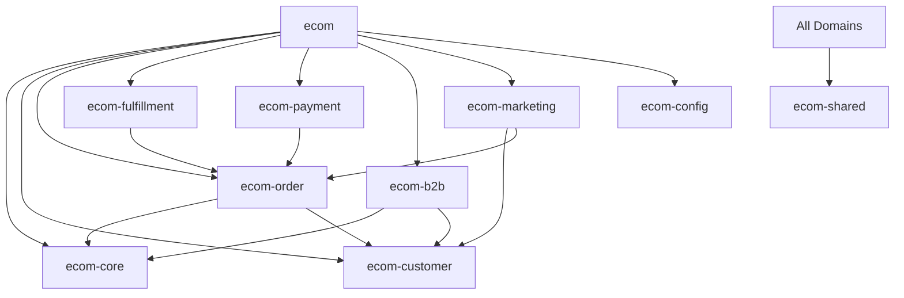

# E-commerce Schema Migration Summary

## Overview

Successfully migrated the monolithic e-commerce schema into a domain-driven architecture with 9 specialized packages. This migration eliminates duplication, improves maintainability, and establishes clear boundaries between domains.

## New Package Structure

```
packages/
├── ecom/                    # Main orchestrator package
├── ecom-core/              # Products, inventory, collections
├── ecom-customer/          # Customer profiles, groups, addresses
├── ecom-order/             # Cart, checkout, orders
├── ecom-fulfillment/       # Shipping, locations, fulfillment
├── ecom-payment/           # Transactions, refunds, disputes
├── ecom-b2b/              # Companies, price lists, purchase orders
├── ecom-marketing/         # Campaigns, abandoned carts, notifications
├── ecom-config/           # Shop settings, feature flags, countries
└── ecom-shared/           # Normalized common schemas (NEW)
```

## Key Accomplishments

### 1. Domain Separation ✅
- Migrated 40+ schema files into appropriate domain packages
- Each domain has clear responsibilities and boundaries
- Dependencies between domains are explicit and managed

### 2. Duplication Elimination ✅
- **Consolidated price lists**: Merged 3 duplicate definitions into single source in `ecom-b2b`
- **Unified customer groups**: Removed duplicate, now single source in `ecom-customer`
- **Merged discount schemas**: Combined volume discounts and price rules in `ecom-b2b`

### 3. New Shared Package (`ecom-shared`) ✅
Created normalized, reusable schemas:

#### **Address System**
- `address` table: Normalized address storage
- `addressReference` table: Polymorphic linking to any entity
- Replaces inline address fields in orders, customers, etc.

#### **Pricing System**
- `money` table: Multi-currency amount storage
- `priceSet` table: Comprehensive pricing with shop/presentment currencies
- `priceReference` table: Links prices to entities
- `taxLine` table: Normalized tax information

#### **Common Utilities**
- `metafield`: Universal key-value storage for any entity
- `tag` & `tagAssignment`: Flexible tagging system
- `note`: Comments/notes for any entity
- `activityLog`: Comprehensive audit trail

## Migration Benefits

### Before
- 40+ files in single directory
- Duplicate table definitions
- No clear boundaries
- 100+ column order table
- Inline address/pricing data

### After
- Organized into 9 domain packages
- No duplication
- Clear domain boundaries
- Normalized data structures
- Reusable shared components

## Package Dependencies



## Files Consolidated/Removed

### B2B Domain Consolidation
- `b2b-features.ts` → `companies.ts`, `price-lists.ts`
- `discount-rules.ts` → `discounts.ts`, `price-lists.ts`
- `price-rule.ts` → `discounts.ts`

### Moved to Documentation
- `hybrid-approach.ts` → `/docs/planning/`
- `improved-variants-example.ts` → `/docs/planning/`
- `unified-object-model.ts` → `/docs/planning/`
- `variant-refactor-plan.ts` → `/docs/planning/`

## Next Steps

### Immediate Priorities

1. **Update Import Paths**
   - Update all code importing from old `@charmlabs/ecom/schemas`
   - Use new domain-specific imports

2. **Database Migrations**
   - Generate migrations for normalized tables
   - Create migration scripts for data transformation

3. **Add Foreign Keys**
   - Define all relationships in schema files
   - Add proper cascade rules

### Future Enhancements

1. **Service Layer**
   - Add domain services to each package
   - Implement repository patterns

2. **Type Safety**
   - Create branded types for IDs
   - Add runtime validation

3. **Testing**
   - Add unit tests for each domain
   - Integration tests for cross-domain operations

4. **Documentation**
   - API documentation for each domain
   - Usage examples and best practices

## Breaking Changes

### Import Path Changes
```typescript
// Before
import { product, customer, order } from "@charmlabs/ecom/schemas";

// After
import { product } from "@charmlabs/ecom-core";
import { customer } from "@charmlabs/ecom-customer";
import { order } from "@charmlabs/ecom-order";
```

### Table Name Changes
- None - all table names remain the same

### Schema Changes
- `customerGroup` removed from B2B (use `ecom-customer` version)
- Price lists consolidated into single definition
- New normalized tables require migration for:
  - Addresses (extract from inline fields)
  - Pricing (extract from inline fields)
  - Metafields (consolidate from multiple tables)

## Migration Checklist

- [x] Create domain package structure
- [x] Move schemas to appropriate domains
- [x] Create package.json for each domain
- [x] Consolidate duplicate schemas
- [x] Create index files for exports
- [x] Update main package to export domains
- [x] Create shared package for common schemas
- [x] Document migration changes
- [ ] Update application imports
- [ ] Generate database migrations
- [ ] Test all domains
- [ ] Deploy changes

## Summary

This migration transforms a monolithic 40+ file schema directory into a well-organized, domain-driven architecture with clear boundaries and no duplication. The new structure is more maintainable, scalable, and follows best practices for large-scale e-commerce applications.